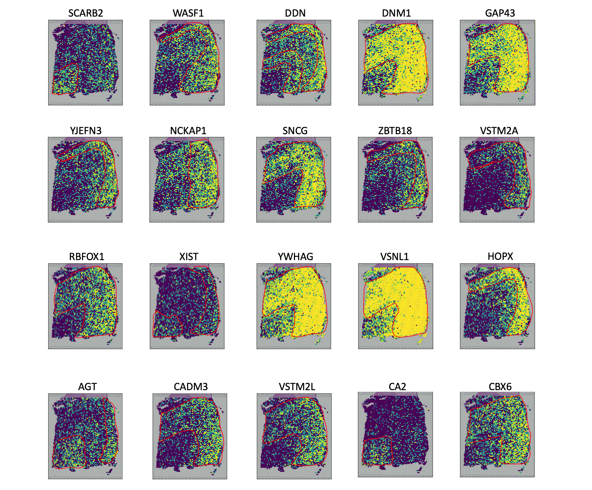

Tutorial 5: Identifying FVGs in 10X Visium DLPFC dataset
========================================================

.. raw:: html

    
In this tutorial, we show how to apply DenoiseST to identify FVGs on 10X Visium DLPFC dataset. As a example, we analyse the Visium dataset.

^^^^^^^^^^^^^^^^^^^^^^^^^^^^^^^^^^^^^^^^^^^^^^^^^^^^^^^^^^^^^^^^^^^^^^^^^^^^^^^^^^^^^^^^^^^^^^^^^^^^^^^^^^^^^^^^^^^^^^^^^^^^^^^^^^^^^^^^^^^^^^^^^^^^

.. raw:: html

    
The source code package is freely available at https://github.com/cuiyaxuan/DenoiseST/tree/master. The datasets used in this study can be found at https://drive.google.com/drive/folders/1H-ymfCqlDR1wpMRX-bCewAjG5nOrIF51?usp=sharing.

^^^^^^^^^^^^^^^^^^^^^^^^^^^^^^^^^^^^^^^^^^^^^^^^^^^^^^^^^^^^^^^^^^^^^^^^^^^^^^^^^^^^^^^^^^^^^^^^^^^^^^^^^^^^^^^^^^^^^^^^^^^^^^^^^^^^^^^^^^^^^^^^^^^^^^^^^^^^^^^^^^^^^^^^^^^^^^^^^^^^^^^^^^^^^^^^^^^^^^^^^^^^^^^^^^^^^^^^^^^^^^^^^^^^^^^^

.. raw:: html

    
First, cd /home/.../DenoiseST-main/FVG

^^^^^^^^^^^^^^^^^^^^^^^^^^^^^^^^^^^^^^^^^^^^^^^^^^^^^^^^^^^^^^^^^^^^^^^^^^^^^^^

.. code:: ipython3

    # we execute the FVG model in the R environment.
    
    conda create -n r4
    source activate r4

    conda search r-base
    conda install r-base=4.2.0
    conda install conda-forge::r-seurat==4.4.0
    conda install conda-forge::r-hdf5r

.. raw:: html

    
Using R virtual environment with conda。

^^^^^^^^^^^^^^^^^^^^^^^^^^^^^^^^^^^^^^^^^^^^^^^^^^^^^^^^^^^^^^^^^^^^^^^^^^^^^^^

.. code:: ipython3
    
    install.packages("devtools")
    devtools::install_github("shaoqiangzhang/DEGman")

    install.packages("hdf5r")
    install.packages('philentropy')
    install.packages('dplyr')
    install.packages('foreach')
    install.packages('parallel')
    install.packages('doParallel')
    install.packages('tidyverse')

.. code:: ipython3

    # You can find the estimate clustering labels and the running results in the DenoiseST/FVG_genename/151673_FVG_result/.
    
    library(DEGman)
    library("Seurat")
    library("dplyr")
    library("hdf5r")
    library(philentropy)
    library(foreach)
    library(doParallel)
    source('distribution.R')
    
    hc1= Read10X_h5('/home/cuiyaxuan/spatialLIBD/151673/151673_filtered_feature_bc_matrix.h5') #### to your path and project name
    label=read.csv("/home/cuiyaxuan/metric_change/revise_R2/est_151673/conlabel.csv",header = T,row.names = 1) #### to your path of cluster label
    n=1 ##### Marker genes identified for a specific cluster. 
    dis<-distri(hc1,label,n)
    
    #You can obtain marker genes for all clusters using the following command. Additionally, you can obtain the most significant genes with the following command.
    
    files<-dir(path = "./",full.names = T,pattern = ".csv")
    library(tidyverse)
    df<-map(files,read.csv)
    class(df)
    vec1=df[[1]]
    for (i in 2:length(df)) {
      vec1=rbind(vec1,df[[i]])
    }
    fre=table(vec1$x)
    
    rounded_number=3 #You can choose the cluster by default, which is "cluster/2-1", or specify your own cluster using the following command.
    fre=names(table(vec1$x))[table(vec1$x)>=rounded_number]
    write.csv(fre,"df1.csv")
    
    #################################Functionally variable genes weight compute################################
    
    library("Seurat")
    library("dplyr")
    library("hdf5r")
    library(philentropy)
    library(foreach)
    library(doParallel)
    
    
    
    source('test_finally.R')
    hc1= Read10X_h5('/home/cuiyaxuan/spatialLIBD/151673/151673_filtered_feature_bc_matrix.h5') #### to your path and project name
    tissue_local=read.csv("/home/cuiyaxuan/spatialLIBD/151673/spatial/tissue_positions_list.csv",row.names = 1,header = FALSE) #### to your path and project name
    print(dim(tissue_local))
    pbmc=CreateSeuratObject(counts = hc1, project = "HC_1", min.cells = 10)
    pbmc=NormalizeData(pbmc, normalization.method = "LogNormalize", scale.factor = 10000)
    pbmc <- FindVariableFeatures(pbmc, selection.method = "vst", nfeatures = 30000)
    all.genes <- rownames(pbmc)
    mat<-as.matrix(pbmc[["RNA"]]@data)
    a <- VariableFeatures(pbmc)
    mat=mat[rownames(mat) %in% a,]
    mat=t(mat)
    aa <- rownames(mat)
    tissue_local=tissue_local[rownames(tissue_local) %in% aa,]
    
    DF1 <- mutate(tissue_local, id = rownames(tissue_local))
    mat=as.data.frame(mat)
    DF2 <- mutate(mat, id = rownames(mat))
    dat=merge(DF1,DF2,by="id")
    x_y_list=dat[,3:4]
    dat=t(dat)
    df1=read.csv("df1.csv",row.names = 1,header = T)
    
    dat1=dat[rownames(dat) %in% df1[,1],]
    dat1=t(dat1)
    n_cores=24
    cls <- makeCluster(n_cores) ## call 24 cpu cores
    registerDoParallel(cls)
    crinum=foreach(q=1:dim(dat1)[2],.combine='rbind') %dopar% cripar(q,dat1,x_y_list,Ccri=50,highval=500,lowval=50) #These are default parameters. Users can adjust the parameters according to their own datasets, including the radius length and filtering for high and low expressions.
    stopCluster(cls)
    fvg=cbind(df1,crinum)
    fvg_sort <- fvg[order(-fvg$crinum), ]
    
    write.csv(fvg_sort ,"fvg.csv")

.. parsed-literal::

    /home/cuiyaxuan/anaconda3/envs/pytorch/lib/python3.8/site-packages/tqdm/auto.py:22: TqdmWarning: IProgress not found. Please update jupyter and ipywidgets. See https://ipywidgets.readthedocs.io/en/stable/user_install.html
      from .autonotebook import tqdm as notebook_tqdm
    /home/cuiyaxuan/anaconda3/envs/pytorch/lib/python3.8/site-packages/anndata/_core/anndata.py:1830: UserWarning: Variable names are not unique. To make them unique, call `.var_names_make_unique`.
      utils.warn_names_duplicates("var")
    /home/cuiyaxuan/anaconda3/envs/pytorch/lib/python3.8/site-packages/scanpy/readwrite.py:413: DtypeWarning: Columns (1,2,3,4,5) have mixed types. Specify dtype option on import or set low_memory=False.
      positions = pd.read_csv(files['tissue_positions_file'], header=None)

